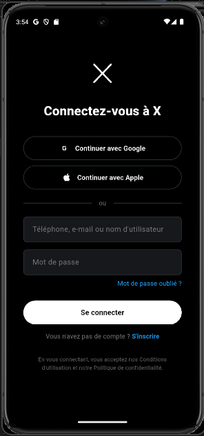

# X Login UI Clone

A **pixel-perfect recreation of the X (formerly Twitter) login screen** built with Flutter, crafted as a UI practice project to sharpen layout and component skills.

## Features

**Faithful UI Reproduction** – Login screen closely mirrors the original X design with a clean, minimal aesthetic  
**Responsive Layout** – Adapts correctly across Android, iOS and Web  
**Reusable Component Structure** – Code organized into clean, maintainable Flutter widgets  

## Technologies Used

- **Flutter** – Cross-platform UI framework
- **Dart** – Application logic and widget structure

## Preview

